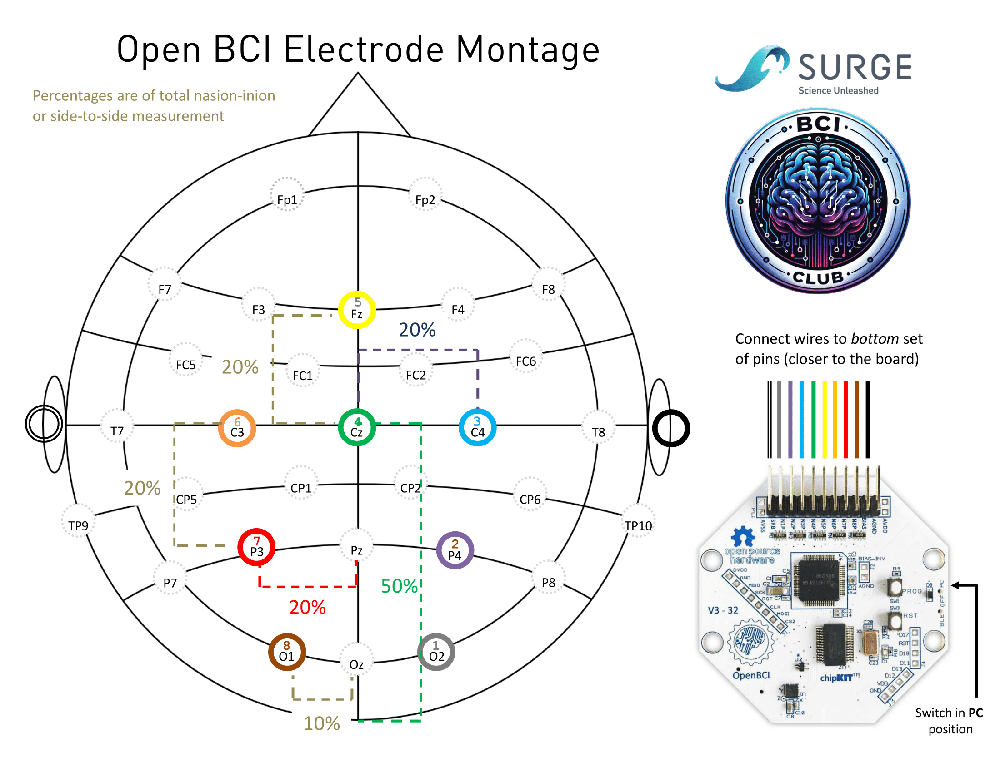

# Real-Time EEG Stream: Setup Instructions  

This guide provides resources to help you set up **real-time EEG data acquisition** for your BCI project.

---

## Prerequisites
Before you begin, ensure you have:  
- **Python** installed, preferably using the provided `Brainhack` environment.  
  - **See [python_setup.md](../getting-setup/python_setup.md) for installation instructions.**  
- **OpenBCI GUI** (optional but useful for real-time EEG visualization).  
  - Download from the [OpenBCI website](https://openbci.com/downloads).  


---

## **OpenBCI Cyton Board Setup**  

We have **5 [OpenBCI Cyton boards](https://docs.openbci.com/Cyton/CytonLanding/)** available for use during the hackathon.  

📖 **Refer to the** [Cyton "Getting Started" Guide](https://docs.openbci.com/GettingStarted/Boards/CytonGS/) **for full setup instructions.**  

### **Step 1: Connect and Power the Cyton Board**
1. Connect the **dongle to your laptop** (ensure it's detected in Device Manager or equivalent). 
2. Insert **AA or rechargeable batteries** and turn the Cyton board **ON**.   
3. Open the **OpenBCI GUI** and verify that EEG signals are streaming correctly.  

### **Step 2: Streaming EEG Data in Python**
To stream data from the Cyton board using Python, see:  
📄 **[OpenBCI Realtime Example Notebook](./example-scripts/OpenBCI_Realtime_Example.ipynb)** in `example-scripts/`.  

---

## Electrode Placement & Montage
We have provided a standard Cyton montage, optimized for common EEG-based BCIs.
However, you may need to adjust the electrode placements depending on your project (e.g., P300, SSVEP, Motor Imagery).

**Example Adjustments:**
- **SSVEP:** Place electrodes at O1, O2, and POz for visual cortex signals.
- **P300:** Use Pz, Cz, and Fz for event-related potentials.
- **Motor Imagery:** Position electrodes around C3 and C4 for movement-based BCIs.

### Standard Cyton Montage:


---

## Next Steps:
- Run the OpenBCI GUI to verify data streaming.
- Use the provided Jupyter notebook to start processing real-time EEG data.
- Integrate EEG signals into your application (P300, SSVEP, MI, etc.).

Happy Hacking!

---

## Troubleshooting

### Dongle not detected by the computer
- **Windows:** Open Device Manager and look for an unknown USB device. It will look like `COM1`, `COM2`, etc.
  - You may need to install the [FTDI VCP driver](https://ftdichip.com/drivers/vcp-drivers/).
- **Linux:** Run `ls /dev/ttyUSB*`. If nothing appears, add yourself to the `dialout` group and log out/in:
  ```bash
  sudo usermod -aG dialout $USER
  ```
- **macOS:** Run `ls /dev/cu.*`. If the port is absent, install the [FTDI VCP driver](https://ftdichip.com/drivers/vcp-drivers/).

### Board not connecting in the OpenBCI GUI
1. Confirm the Cyton board switch is in the **ON** position.
2. Check that the dongle's LED is blinking — no blink usually means the board is off or out of range.
3. **Replace the batteries.** Low battery is the most common cause of connection failure.
4. Close any other program (including Python scripts) that may have already opened the serial port.

### Serial port permission error in Python (Linux)
```
serial.serialutil.SerialException: [Errno 13] Permission denied: '/dev/ttyUSB0'
```
Run the following, then log out and back in:
```bash
sudo usermod -aG dialout $USER
```

### Don't know which serial port to use
The `find_device_ports()` helper in `brainflow_stream.py` will auto-detect compatible devices. If you need to find it manually:
- **Windows:** Check Device Manager → Ports (COM & LPT) — typically `COM3` or `COM4`.
- **Linux:** `/dev/ttyUSB0` or `/dev/ttyUSB1`
- **macOS:** `/dev/cu.usbserial-XXXX`

### BrainFlow `BOARD_NOT_READY` error or timeout
- Confirm the correct serial port is being passed to `BoardShim`.
- Make sure the board is powered on and the dongle is connected *before* running your script.
- Try power-cycling the board (off → wait 5 seconds → on).

### Flat, rail-clipped, or very noisy EEG signal
- Apply a small amount of conductive gel to each electrode and press firmly against the scalp.
- Ensure the **SRB (reference)** and **BIAS (ground)** electrodes are attached, typically clipped to the earlobes.
- Check electrode impedance in the OpenBCI GUI; aim for below ~20 kΩ (shown in green).
- Keep electrode cables away from laptop chargers and power cables to reduce 50/60 Hz noise.